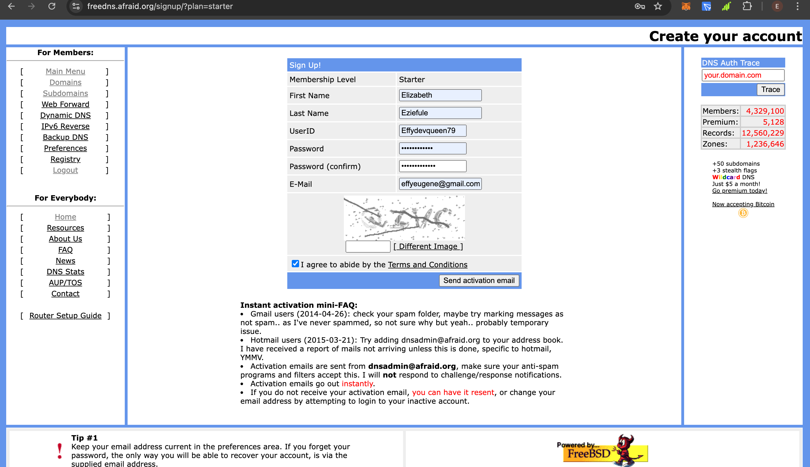

# Project - GoPro

**“Imagine you are part of a startup team tasked with creating a prototype for a web application. Your first step is to provision a server and set up a simple landing page to demonstrate your team’s capabilities to potential investors.”**

**Your task is as follows:**

1. **Provisioning the Server:**
   - Use any virtualization or cloud platform (e.g., AWS) to set up a **Linux server**.
   - Install a Linux distribution of your choice (e.g., Ubuntu).

2. **Web Server Setup:**
   - Install a web server (e.g., Apache, Nginx) to serve web content.

3. **HTML Page Deployment:**
   - Create a simple HTML page with the following information:
     - Your name.
     - A project title: “Welcome to [Your Name] Landing Page.”
     - A brief description of your project.
     - Your full bio with every interesting information about you.
   - Deploy the HTML page on the server.

4. **Networking:**
   - Configure the server to allow HTTP traffic (port 80).
   - Provide the public IP address (or URL if using DNS) so your page can be accessed from any browser.

**Deliverables:**

- The **public IP address or URL** of your web page.
- A screenshot showing your HTML page in a browser.
- Write clear, step-by-step documentation of how you provisioned the server, installed the web server, deployed the HTML page, and configured networking.

**Bonus Tasks (Optional):**

- Configure HTTPS for your web server using a free SSL certificate (e.g., Let’s Encrypt).

---

# Documentation

## Introduction

The project implementation is divided into three parts:
- **PART A**: Linux Server and Apache Web Server Setup
- **PART B**: DNS Mapping, Web Hosting, and Assigning SSL Certificate
- **PART C**: Version Control and GitHub

## Prerequisites:
1. AWS account with at least one user having admin permission and EC2 full access.
2. A GitHub account.
3. Git installed on your computer.
4. Knowledge of using Git.
5. Basic Linux commands.

---

### **Setting Up GitHub Repository**
1. Log into GitHub and create a new repository for the project.
2. Create a folder on your local machine to hold the project code and documentation.
3. Clone the repository onto your local machine:
   ```bash
   mkdir project-gopro
   cd project-gopro
   git clone https://github.com/Effydevqueen/Project--Gopro.git

### PART A: Linux Server and Apache Web Server Setup
# Provisioning the Server

1. **Log in to the AWS platform** and navigate to the EC2 service.

2. **Launch a new EC2 instance:**
   - Input a name for the instance.
   - Select **Ubuntu** as the OS (AMI).
   - Choose **64-bit (x86)** architecture.
   - Use **t2.micro** (free tier).
   - Create or use an existing key pair and download the `.pem` file.
   - Configure a security group:
     - Allow **SSH** (port 22) from my ip.
     - Allow **HTTP** (port 80) from anywhere (o.0.0.0/0).
     - Allow **HTTPS** (port 443) from anywhere (o.0.0.0/0).
   - Configure storage (default: 8 GB).
   - Click on **Launch Instance**.
     


3. **Connect to the instance via SSH:**
   
   Using the terminal, connect to the instance with SSH.

   Navigate to the folder where the downloaded key pair was saved.
   
   Use this command:
   ```bash
   ssh -i "your-key.pem" ubuntu@<your-ec2-public-ip>
   
   ssh -i "Alt_exam@semester@.pem" ubuntu@ec2-3-85-231-215.compute-1.amazonaws.com


 
 
# **Logging into the Instance and Updating the Server**

You should be logged in as an Ubuntu user.

Switch from the **Ubuntu user** to **root** and update the instance.

Run the following commands:

   switch to the root user with superuser permissions:
   Update and Upgrade the Instance recent versions and updates.
   
  ```bash

  sudo su

  Apt update
  Apt upgrade -y


```

 

## Install Apache webserver
Installed the Apache2 web server:
  ```bash
 apt install apache2
```
 
 

 ##  Start and Enable Apache
After installing Apache2 
 Enable it and then check the status.

   
  ```bash
  systemctl start apache2
  systemctl enable apache2
  systemctl status apache2

```
  

 we can see our server is running and active

## Conduct a browser test for Apache
confirm  that the apache server is live and accessible by going to your aws account to copy your public ipv4 address and pasting it on a browser.

! [browsertest](./img/brosweripv4test.png)


Ensure your protocol is set to http else you'll get an error.

e.g  [http://3.85.231.215/] not (https://3.85.231.215/) 


if everything is done right you should see something like this.


## Replace Default Index.html
Back to your terminal run the following command below.

Navigavte to the html directory
```
 cd /var/www/html 
ls  
```
Edit the index.html file
```
 vi index.html
```
paste the content of your own web page in this index.html file or simply delete and create your own index.html.


### PART B: DNS Mapping, Web Hosting, and Assigning SSL Certificate

## Create a Domain
Registered a free domain using afraid.dns.

and configure the public ipv4 address to the registred domain



## Install Certbot for SSL

run the following command
```bash
 sudo apt install certbot python3-certbot-apache -y
```


```bash
sudo cerbot --apache
```
follow the prompt and enter email 


## Verify SSL Assignment

Tested to ensure SSL was correctly assigned to my domain.


After completeing the steps 

Apache was running with my  custom  index.html landing page.
SSL was successfully installed and verified.
My web server was accessible via the custom domain at https://web.elizabetheziefule.mooo.com/.


## **Stack Used**

1. **Linux Ubuntu 20.04 LTS** distro  
2. **AWS Cloud** virtualization platform  
3. **Web server**: Apache2  
4. **IDE**: Termius and VS Code  
5. **Version control**: Git  
6. **Remote repository**: GitHub  

---

PART C: Version Control and GitHub


##Push project files and documentation to GitHub:
```bash
git add .
git commit -m "Initial commit"
git push origin main
```

### **Conclusion**

The **GoPro project** effectively demonstrates the essential skills required to set up a full-stack prototype. By leveraging AWS for virtualization, Apache2 for web hosting, and GitHub for version control, it highlights an understanding of modern web development and deployment practices.

**Key takeaways from the project:**

- **Technical Acumen**: The ability to provision cloud resources, configure a web server, and manage networking.  
- **Security Practices**: Implementing HTTPS ensures data integrity and builds trust with users.  
- **Version Control**: Using Git and GitHub ensures collaborative and structured development.  

This project showcases a robust approach to delivering a working prototype, reflecting both technical capability and attention to detail in documentation and implementation.

